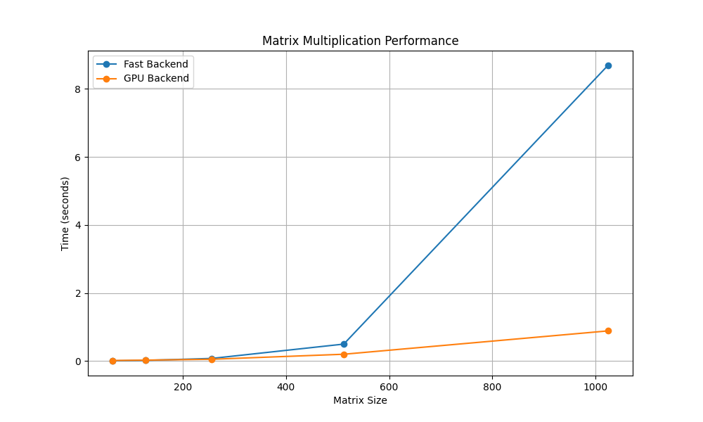

# MiniTorch Module 3


* Docs: https://minitorch.github.io/

* Overview: https://minitorch.github.io/module3.html


You will need to modify `tensor_functions.py` slightly in this assignment.

* Tests:

```
python run_tests.py
```

* Note:

Several of the tests for this assignment will only run if you are on a GPU machine and will not
run on github's test infrastructure. Please follow the instructions to setup up a colab machine
to run these tests.

This assignment requires the following files from the previous assignments. You can get these by running

```bash
python sync_previous_module.py previous-module-dir current-module-dir
```

The files that will be synced are:

        minitorch/tensor_data.py minitorch/tensor_functions.py minitorch/tensor_ops.py minitorch/operators.py minitorch/scalar.py minitorch/scalar_functions.py minitorch/module.py minitorch/autodiff.py minitorch/module.py project/run_manual.py project/run_scalar.py project/run_tensor.py minitorch/operators.py minitorch/module.py minitorch/autodiff.py minitorch/tensor.py minitorch/datasets.py minitorch/testing.py minitorch/optim.py

## Module 3.1 and 3.2 Stuff
```
MAP
 
================================================================================
 Parallel Accelerator Optimizing:  Function tensor_map.<locals>._map,
C:\Users\Elia\OneDrive\Dokumente\Grad\mod3-primordialls\minitorch\fast_ops.py
(165)
================================================================================


Parallel loop listing for  Function tensor_map.<locals>._map, C:\Users\Elia\OneDrive\Dokumente\Grad\mod3-primordialls\minitorch\fast_ops.py (165)
-----------------------------------------------------------------------------|loop #ID
    def _map(                                                                |
        out: Storage,                                                        |
        out_shape: Shape,                                                    |
        out_strides: Strides,                                                |
        in_storage: Storage,                                                 |
        in_shape: Shape,                                                     |
        in_strides: Strides,                                                 |
    ) -> None:                                                               |
        if np.array_equal(out_strides, in_strides) and np.array_equal(       |
            out_shape, in_shape                                              |
        ):                                                                   |
            for i in prange(len(out)):---------------------------------------| #0
                out[i] = fn(in_storage[i])                                   |
        else:                                                                |
            for i in prange(len(out)):---------------------------------------| #1
                out_index: Index = np.empty(MAX_DIMS, np.int32)              |
                in_index: Index = np.empty(MAX_DIMS, np.int32)               |
                to_index(i, out_shape, out_index)                            |
                broadcast_index(out_index, out_shape, in_shape, in_index)    |
                o = index_to_position(out_index, out_strides)                |
                a = index_to_position(in_index, in_strides)                  |
                out[o] = fn(in_storage[a])                                   |
--------------------------------- Fusing loops ---------------------------------
Attempting fusion of parallel loops (combines loops with similar properties)...
Following the attempted fusion of parallel for-loops there are 2 parallel for-
loop(s) (originating from loops labelled: #0, #1).
--------------------------------------------------------------------------------
----------------------------- Before Optimisation ------------------------------
--------------------------------------------------------------------------------
------------------------------ After Optimisation ------------------------------
Parallel structure is already optimal.
--------------------------------------------------------------------------------
--------------------------------------------------------------------------------

---------------------------Loop invariant code motion---------------------------
Allocation hoisting:
The memory allocation derived from the instruction at
C:\Users\Elia\OneDrive\Dokumente\Grad\mod3-primordialls\minitorch\fast_ops.py
(180) is hoisted out of the parallel loop labelled #1 (it will be performed
before the loop is executed and reused inside the loop):
   Allocation:: out_index: Index = np.empty(MAX_DIMS, np.int32)
    - numpy.empty() is used for the allocation.
The memory allocation derived from the instruction at
C:\Users\Elia\OneDrive\Dokumente\Grad\mod3-primordialls\minitorch\fast_ops.py
(181) is hoisted out of the parallel loop labelled #1 (it will be performed
before the loop is executed and reused inside the loop):
   Allocation:: in_index: Index = np.empty(MAX_DIMS, np.int32)
    - numpy.empty() is used for the allocation.
None
ZIP
 
================================================================================
 Parallel Accelerator Optimizing:  Function tensor_zip.<locals>._zip,
C:\Users\Elia\OneDrive\Dokumente\Grad\mod3-primordialls\minitorch\fast_ops.py
(214)
================================================================================


Parallel loop listing for  Function tensor_zip.<locals>._zip, C:\Users\Elia\OneDrive\Dokumente\Grad\mod3-primordialls\minitorch\fast_ops.py (214)
---------------------------------------------------------------------------|loop #ID
    def _zip(                                                              |
        out: Storage,                                                      |
        out_shape: Shape,                                                  |
        out_strides: Strides,                                              |
        a_storage: Storage,                                                |
        a_shape: Shape,                                                    |
        a_strides: Strides,                                                |
        b_storage: Storage,                                                |
        b_shape: Shape,                                                    |
        b_strides: Strides,                                                |
    ) -> None:                                                             |
        # Check if shapes and strides align for direct iteration           |
        if (                                                               |
            np.array_equal(out_strides, a_strides)                         |
            and np.array_equal(out_strides, b_strides)                     |
            and np.array_equal(out_shape, a_shape)                         |
            and np.array_equal(out_shape, b_shape)                         |
        ):                                                                 |
            for i in prange(len(out)):-------------------------------------| #2
                out[i] = fn(a_storage[i], b_storage[i])                    |
        else:                                                              |
            for i in prange(len(out)):-------------------------------------| #3
                out_index = np.empty(MAX_DIMS, dtype=np.int32)             |
                a_index = np.empty(MAX_DIMS, dtype=np.int32)               |
                b_index = np.empty(MAX_DIMS, dtype=np.int32)               |
                to_index(i, out_shape, out_index)                          |
                broadcast_index(out_index, out_shape, a_shape, a_index)    |
                broadcast_index(out_index, out_shape, b_shape, b_index)    |
                o = index_to_position(out_index, out_strides)              |
                a = index_to_position(a_index, a_strides)                  |
                b = index_to_position(b_index, b_strides)                  |
                out[o] = fn(a_storage[a], b_storage[b])                    |
--------------------------------- Fusing loops ---------------------------------
Attempting fusion of parallel loops (combines loops with similar properties)...
Following the attempted fusion of parallel for-loops there are 2 parallel for-
loop(s) (originating from loops labelled: #2, #3).
--------------------------------------------------------------------------------
----------------------------- Before Optimisation ------------------------------
--------------------------------------------------------------------------------
------------------------------ After Optimisation ------------------------------
Parallel structure is already optimal.
--------------------------------------------------------------------------------
--------------------------------------------------------------------------------

---------------------------Loop invariant code motion---------------------------
Allocation hoisting:
The memory allocation derived from the instruction at
C:\Users\Elia\OneDrive\Dokumente\Grad\mod3-primordialls\minitorch\fast_ops.py
(236) is hoisted out of the parallel loop labelled #3 (it will be performed
before the loop is executed and reused inside the loop):
   Allocation:: out_index = np.empty(MAX_DIMS, dtype=np.int32)
    - numpy.empty() is used for the allocation.
The memory allocation derived from the instruction at
C:\Users\Elia\OneDrive\Dokumente\Grad\mod3-primordialls\minitorch\fast_ops.py
(237) is hoisted out of the parallel loop labelled #3 (it will be performed
before the loop is executed and reused inside the loop):
   Allocation:: a_index = np.empty(MAX_DIMS, dtype=np.int32)
    - numpy.empty() is used for the allocation.
The memory allocation derived from the instruction at
C:\Users\Elia\OneDrive\Dokumente\Grad\mod3-primordialls\minitorch\fast_ops.py
(238) is hoisted out of the parallel loop labelled #3 (it will be performed
before the loop is executed and reused inside the loop):
   Allocation:: b_index = np.empty(MAX_DIMS, dtype=np.int32)
    - numpy.empty() is used for the allocation.
None
REDUCE
 
================================================================================
 Parallel Accelerator Optimizing:  Function tensor_reduce.<locals>._reduce,
C:\Users\Elia\OneDrive\Dokumente\Grad\mod3-primordialls\minitorch\fast_ops.py
(271)
================================================================================


Parallel loop listing for  Function tensor_reduce.<locals>._reduce, C:\Users\Elia\OneDrive\Dokumente\Grad\mod3-primordialls\minitorch\fast_ops.py (271)
-----------------------------------------------------------------------|loop #ID
    def _reduce(                                                       |
        out: Storage,                                                  |
        out_shape: Shape,                                              |
        out_strides: Strides,                                          |
        a_storage: Storage,                                            |
        a_shape: Shape,                                                |
        a_strides: Strides,                                            |
        reduce_dim: int,                                               |
    ) -> None:                                                         |
        for i in prange(len(out)):-------------------------------------| #4
            out_index = np.empty(MAX_DIMS, dtype=np.int32)             |
            a_index = np.empty(MAX_DIMS, dtype=np.int32)               |
            to_index(i, out_shape, out_index)                          |
            broadcast_index(out_index, out_shape, a_shape, a_index)    |
            o = index_to_position(out_index, out_strides)              |
            a = index_to_position(a_index, a_strides)                  |
            out[o] = a_storage[a]                                      |
            for j in range(1, a_shape[reduce_dim]):                    |
                a_index[reduce_dim] = j                                |
                a = index_to_position(a_index, a_strides)              |
                out[o] = fn(out[o], a_storage[a])                      |
--------------------------------- Fusing loops ---------------------------------
Attempting fusion of parallel loops (combines loops with similar properties)...
Following the attempted fusion of parallel for-loops there are 1 parallel for-
loop(s) (originating from loops labelled: #4).
--------------------------------------------------------------------------------
----------------------------- Before Optimisation ------------------------------
--------------------------------------------------------------------------------
------------------------------ After Optimisation ------------------------------
Parallel structure is already optimal.
--------------------------------------------------------------------------------
--------------------------------------------------------------------------------

---------------------------Loop invariant code motion---------------------------
Allocation hoisting:
The memory allocation derived from the instruction at
C:\Users\Elia\OneDrive\Dokumente\Grad\mod3-primordialls\minitorch\fast_ops.py
(281) is hoisted out of the parallel loop labelled #4 (it will be performed
before the loop is executed and reused inside the loop):
   Allocation:: out_index = np.empty(MAX_DIMS, dtype=np.int32)
    - numpy.empty() is used for the allocation.
The memory allocation derived from the instruction at
C:\Users\Elia\OneDrive\Dokumente\Grad\mod3-primordialls\minitorch\fast_ops.py
(282) is hoisted out of the parallel loop labelled #4 (it will be performed
before the loop is executed and reused inside the loop):
   Allocation:: a_index = np.empty(MAX_DIMS, dtype=np.int32)
    - numpy.empty() is used for the allocation.
None
MATRIX MULTIPLY
 
================================================================================
 Parallel Accelerator Optimizing:  Function _tensor_matrix_multiply,
C:\Users\Elia\OneDrive\Dokumente\Grad\mod3-primordialls\minitorch\fast_ops.py
(296)
================================================================================


Parallel loop listing for  Function _tensor_matrix_multiply, C:\Users\Elia\OneDrive\Dokumente\Grad\mod3-primordialls\minitorch\fast_ops.py (296)
------------------------------------------------------------------------------------------|loop #ID
def _tensor_matrix_multiply(                                                              |
    out: Storage,                                                                         |
    out_shape: Shape,                                                                     |
    out_strides: Strides,                                                                 |
    a_storage: Storage,                                                                   |
    a_shape: Shape,                                                                       |
    a_strides: Strides,                                                                   |
    b_storage: Storage,                                                                   |
    b_shape: Shape,                                                                       |
    b_strides: Strides,                                                                   |
) -> None:                                                                                |
    """NUMBA tensor matrix multiply function.                                             |
                                                                                          |
    Should work for any tensor shapes that broadcast as long as                           |
                                                                                          |
    ```                                                                                   |
    assert a_shape[-1] == b_shape[-2]                                                     |
    ```                                                                                   |
                                                                                          |
    Optimizations:                                                                        |
                                                                                          |
    * Outer loop in parallel                                                              |
    * No index buffers or function calls                                                  |
    * Inner loop should have no global writes, 1 multiply.                                |
                                                                                          |
                                                                                          |
    Args:                                                                                 |
    ----                                                                                  |
        out (Storage): storage for `out` tensor                                           |
        out_shape (Shape): shape for `out` tensor                                         |
        out_strides (Strides): strides for `out` tensor                                   |
        a_storage (Storage): storage for `a` tensor                                       |
        a_shape (Shape): shape for `a` tensor                                             |
        a_strides (Strides): strides for `a` tensor                                       |
        b_storage (Storage): storage for `b` tensor                                       |
        b_shape (Shape): shape for `b` tensor                                             |
        b_strides (Strides): strides for `b` tensor                                       |
                                                                                          |
    Returns:                                                                              |
    -------                                                                               |
        None : Fills in `out`                                                             |
                                                                                          |
    """                                                                                   |
    a_batch_stride = a_strides[0] if a_shape[0] > 1 else 0                                |
    b_batch_stride = b_strides[0] if b_shape[0] > 1 else 0                                |
                                                                                          |
    for n in prange(out_shape[0]):--------------------------------------------------------| #5
        a_offset = n * a_batch_stride                                                     |
        b_offset = n * b_batch_stride                                                     |
        for i in range(a_shape[1]):                                                       |
            for j in range(b_shape[2]):                                                   |
                sum = 0.0                                                                 |
                for k in range(a_shape[2]):                                               |
                    a_idx = a_offset + i * a_strides[1] + k * a_strides[2]                |
                    b_idx = b_offset + k * b_strides[1] + j * b_strides[2]                |
                    sum += a_storage[a_idx] * b_storage[b_idx]                            |
                out_idx = n * out_strides[0] + i * out_strides[1] + j * out_strides[2]    |
                out[out_idx] = sum                                                        |
--------------------------------- Fusing loops ---------------------------------
Attempting fusion of parallel loops (combines loops with similar properties)...
Following the attempted fusion of parallel for-loops there are 1 parallel for-
loop(s) (originating from loops labelled: #5).
--------------------------------------------------------------------------------
----------------------------- Before Optimisation ------------------------------
--------------------------------------------------------------------------------
------------------------------ After Optimisation ------------------------------
Parallel structure is already optimal.
--------------------------------------------------------------------------------
--------------------------------------------------------------------------------

---------------------------Loop invariant code motion---------------------------
Allocation hoisting:
No allocation hoisting found
None
```

## Module 3.4 Stuff

### Plot


### Raw Data
#### Timing summary
Size: 64
* fast: 0.00545
* gpu: 0.01455

Size: 128
* fast: 0.01786
* gpu: 0.02563

Size: 256
* fast: 0.07524
* gpu: 0.05100

Size: 512
* fast: 0.49722
* gpu: 0.19878

Size: 1024
* fast: 8.69253
* gpu: 0.88500


## CPU Split Dataset (Hidden Layer 100, LR of 0.05)

Average time per epoch: 0.0799858 seconds

### Loss Data
Epoch  0  loss  8.158331075416443 correct 31\
Epoch  10  loss  7.437599609483676 correct 31\
Epoch  20  loss  5.266467804046692 correct 42\
Epoch  30  loss  6.127489741148496 correct 44\
Epoch  40  loss  6.32287763757689 correct 47\
Epoch  50  loss  3.5937361502574583 correct 50\
Epoch  60  loss  2.9464597536641843 correct 49\
Epoch  70  loss  2.3083101191960402 correct 49\
Epoch  80  loss  3.281094219092092 correct 49\
Epoch  90  loss  2.273324330804891 correct 47\
Epoch  100  loss  2.9036972015647353 correct 49\
Epoch  110  loss  1.7240296306482379 correct 49\
Epoch  120  loss  1.8539574134882364 correct 48\
Epoch  130  loss  2.5364299783846684 correct 49\
Epoch  140  loss  2.6421948598536362 correct 47\
Epoch  150  loss  2.552153819277846 correct 47\
Epoch  160  loss  1.109587130552987 correct 50\
Epoch  170  loss  0.8732575599501115 correct 48\
Epoch  180  loss  1.9998000400991935 correct 50

## CPU Xor Dataset (Hidden Layer 100, LR of 0.05)

Average time per epoch: 0.0780816 seconds

### Loss Data
Epoch  0  loss  6.963324767279923 correct 20\
Epoch  10  loss  5.45777000491824 correct 36\
Epoch  20  loss  4.87457880563027 correct 35\
Epoch  30  loss  4.558274762855238 correct 36\
Epoch  40  loss  4.014774153322469 correct 45\
Epoch  50  loss  3.7646734342333 correct 36\
Epoch  60  loss  6.13250661043877 correct 43\
Epoch  70  loss  4.21083551455361 correct 46\
Epoch  80  loss  4.251212141065572 correct 42\
Epoch  90  loss  3.803611009394337 correct 47\
Epoch  100  loss  3.463910071285496 correct 42\
Epoch  110  loss  2.5050982842469347 correct 44\
Epoch  120  loss  4.048149089347216 correct 46\
Epoch  130  loss  2.4252195167359742 correct 47\
Epoch  140  loss  2.860466436383708 correct 47\
Epoch  150  loss  1.9413327065280845 correct 47\
Epoch  160  loss  2.8012195311355077 correct 46\
Epoch  170  loss  2.174051028601034 correct 48\
Epoch  180  loss  2.7060529162380473 correct 46\
Epoch  190  loss  1.1248673094154509 correct 48\
Epoch  200  loss  2.2520491591163077 correct 45\
Epoch  210  loss  0.4388392911593749 correct 45\
Epoch  220  loss  1.4666663885412863 correct 48\
Epoch  230  loss  1.4136876189911727 correct 49\
Epoch  240  loss  1.6202146214801765 correct 49\
Epoch  250  loss  0.9333886271850071 correct 45\
Epoch  260  loss  0.21030483756959817 correct 46\
Epoch  270  loss  1.6515248837757193 correct 48\
Epoch  280  loss  1.1210577954713772 correct 49\
Epoch  290  loss  1.109957957347805 correct 48\
Epoch  300  loss  1.6284584880778346 correct 47\
Epoch  310  loss  0.35605587228822694 correct 47\
Epoch  320  loss  0.4553031094436542 correct 50\
Epoch  330  loss  0.3793793825857032 correct 45\
Epoch  340  loss  1.2802768109023361 correct 50\
Epoch  350  loss  0.480218282644271 correct 48\
Epoch  360  loss  0.40893864501606436 correct 46\
Epoch  370  loss  1.2853273805142622 correct 50

## CPU Simple Dataset (Hidden Layer 100, LR of 0.05)

Average time per epoch: 0.0847381 seconds

### Loss Data
Epoch  0  loss  4.386987428910761 correct 30\
Epoch  10  loss  1.537137494703264 correct 47\
Epoch  20  loss  1.3535009524845734 correct 49\
Epoch  30  loss  0.6428510757025829 correct 50\
Epoch  40  loss  1.6528048324982814 correct 47\
Epoch  50  loss  1.4331737038192442 correct 50\
Epoch  60  loss  0.9905884659905021 correct 49\
Epoch  70  loss  1.0522839560493344 correct 50

## GPU Split Dataset (Hidden Layer 100, LR of 0.05)

Average time per epoch: 2.6070413 seconds

### Loss Data
Epoch  0  loss  6.840350210119134 correct 31\
Epoch  10  loss  3.4110235532733677 correct 38\
Epoch  20  loss  4.408219400736454 correct 42\
Epoch  30  loss  2.776835696002391 correct 41\
Epoch  40  loss  3.964960111738579 correct 41\
Epoch  50  loss  3.0798404970991102 correct 48\
Epoch  60  loss  1.086752331486119 correct 44\
Epoch  70  loss  3.5820589825766858 correct 49\
Epoch  80  loss  1.6311496716079303 correct 49\
Epoch  90  loss  1.766665932212916 correct 49\
Epoch  100  loss  1.8572766479410705 correct 50\
Epoch  110  loss  2.681664579378218 correct 49\
Epoch  120  loss  1.426794110487073 correct 49\
Epoch  130  loss  0.9715168558852108 correct 49\
Epoch  140  loss  0.7424577748469872 correct 50\
Epoch  150  loss  2.005868650170111 correct 49\
Epoch  160  loss  0.45455410411631575 correct 50

## GPU Xor Dataset (Hidden Layer 100, LR of 0.05)

Average time per epoch: 2.8542119 seconds

### Loss Data
Epoch  0  loss  7.246203510350952 correct 32\
Epoch  10  loss  5.288182695729239 correct 44\
Epoch  20  loss  5.188813924795028 correct 46\
Epoch  30  loss  3.7688500384010872 correct 45\
Epoch  40  loss  2.0169916999487634 correct 47\
Epoch  50  loss  3.5352237882025035 correct 48\
Epoch  60  loss  4.6150442423830516 correct 45\
Epoch  70  loss  2.48171359779481 correct 47\
Epoch  80  loss  1.3809887259316747 correct 48\
Epoch  90  loss  2.5912771951306954 correct 47\
Epoch  100  loss  1.0814653863612058 correct 47\
Epoch  110  loss  4.673912731668265 correct 50\
Epoch  120  loss  1.4157393532728295 correct 48\
Epoch  130  loss  1.9795740107645676 correct 47\
Epoch  140  loss  1.4029202090628659 correct 49\
Epoch  150  loss  0.7845117264051655 correct 48\
Epoch  160  loss  0.7195255482093431 correct 48\
Epoch  170  loss  1.694457266390305 correct 50\
Epoch  180  loss  0.8100028192942718 correct 47\
Epoch  190  loss  0.6771936792814539 correct 47\
Epoch  200  loss  0.5224077903164924 correct 47\
Epoch  210  loss  2.029001271108087 correct 50

## GPU Simple Dataset (Hidden Layer 100, LR of 0.05)

Average time per epoch: 2.6921773 seconds

### Loss Data
Epoch  0  loss  5.547381384774088 correct 40\
Epoch  10  loss  2.34969288663491 correct 49\
Epoch  20  loss  1.2827078725508145 correct 50\
Epoch  30  loss  0.09780548182156365 correct 49\
Epoch  40  loss  1.5496472118858655 correct 50\
Epoch  50  loss  0.7052121010513221 correct 49\
Epoch  60  loss  0.5411754874697448 correct 49\
Epoch  70  loss  0.3644210895141787 correct 50